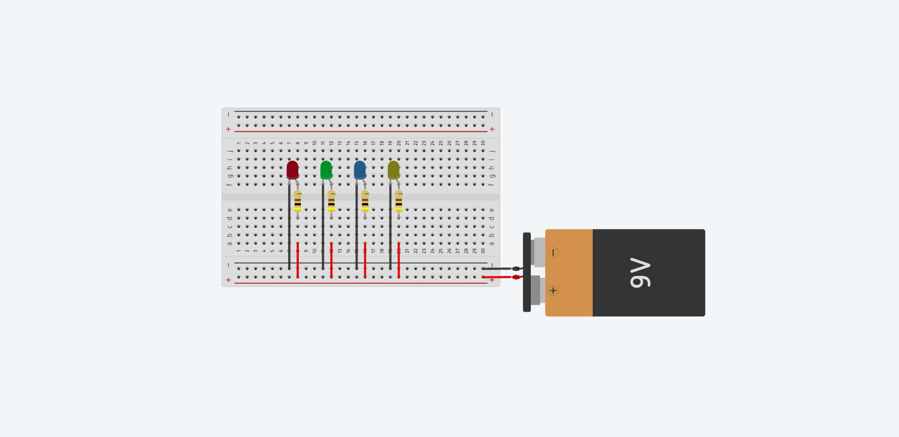
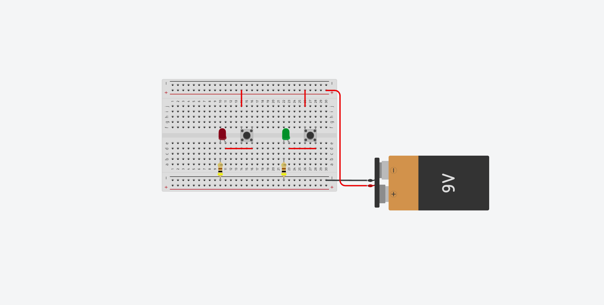

<h1>Aula 1.</h1>

<a href="https://github.com/RAS-UFPB/Resumo-das-aulas-do-Grupo-de-Robotica/tree/main/Resumo%20aula%201"><b>Resumo da aula</b></a>

<h2>Resolução dos desafios</h2>

<h3>Desafio 1</h3>

    <h4>Tabela de materiais necessários para esse desafio</h4>
    <table>
        <tr><td>Quantidade</td> <td>Item</td></tr>
        <tr><td>01</td> <td>Protoboard</td></tr>
        <tr><td>04</td> <td>400Ω Resistor</td></tr>
        <tr><td>04</td> <td>Leds</td></tr>
        <tr><td>01</td> <td>Bateria 9V</td></tr>
        <tr><td>--</td> <td>Fios</td></tr>
    </table>

 

    
<b>Esquema de montagem do circuito</b>

<h3>Desafio 2</h3>

    <h4>Tabela de materiais necessários para esse desafio</h4>
    <table>
        <tr><td>Quantidade</td> <td>Item</td></tr>
        <tr><td>01</td> <td>Protoboard</td></tr>
        <tr><td>02</td> <td>400Ω Resistor</td></tr>
        <tr><td>02</td> <td>Leds</td></tr>
        <tr><td>02</td> <td>Botão</td></tr>
        <tr><td>01</td> <td>Bateria 9V</td></tr>
        <tr><td>--</td> <td>Fios</td></tr>
    </table>

 

    
<b>Esquema de montagem do circuito</b>

