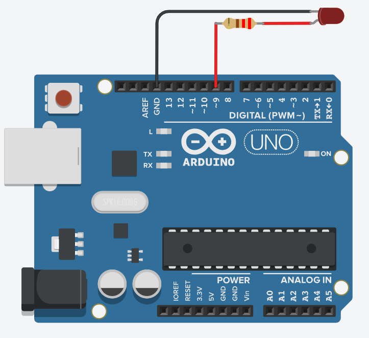
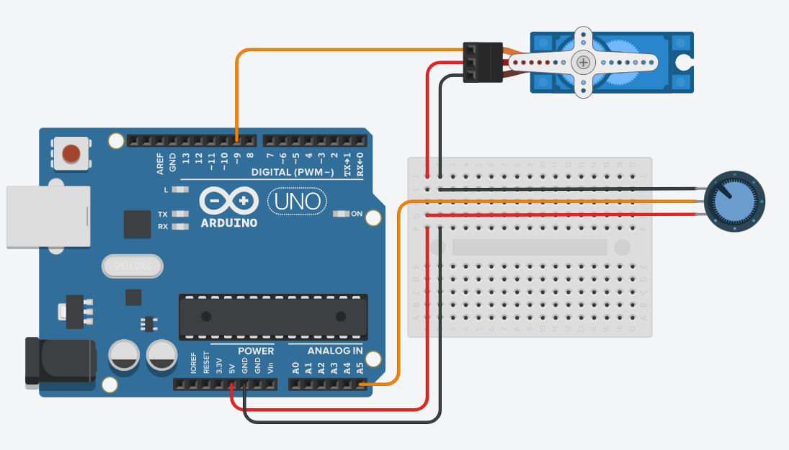
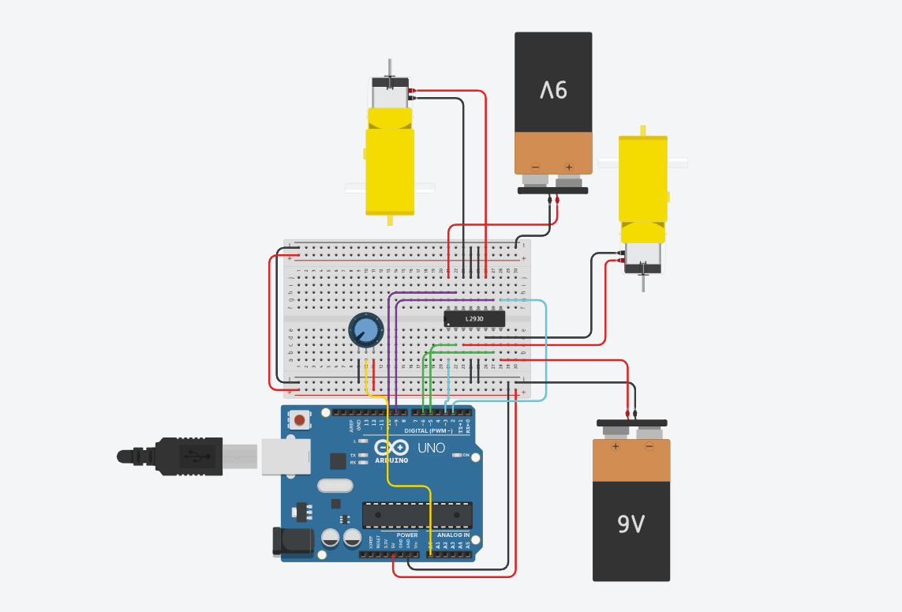

# Aula 3

[**Resumo da aula**](https://github.com/RAS-UFPB/Resumo-das-aulas-do-Grupo-de-Robotica/blob/main/Resumo%20aula%203)

## Resolução dos desafios

### Desafio 1

<div align='center'>

#### Tabela de materiais necessários para esse desafio

| Quantidade | Item |
|------------|------|
| 01 | Arduino Uno |
| 01 | LED |
| 01 | Resistor 220 ohm |
| -- | Fios |

</div>

<br>

<div align="center">



**Esquema de montagem do circuito**

</div>

#### Código
```c++
#define LED_PIN = 9;
int dimmerValue = 0;
void setup() {
    Serial.begin(9600);
    pinMode(LED_PIN, OUTPUT);
}
void loop() {
    if (Serial.available()) {
        dimmerValue = Serial.read();
        dimmerValue = map(dimmerValue, 0, 255, 0, 255);
        analogWrite(LED_PIN, dimmerValue);
        Serial.println(dimmerValue);
    }
}
```

### Desafio 2

<div align='center'>

#### Tabela de materiais necessários para esse desafio

| Quantidade | Item |
|------------|------|
| 01 | Arduino Uno |
| 01 | Protoboard |
| 01 | Potenciômetro |
| 01 | Servo Motor |
| -- | Fios |

</div>

<br>

<div align="center">



**Esquema de montagem do circuito**

</div>

#### Código
```c++
#include <Servo.h>
#define PIN_POTENCIOMETRO A5
#define PIN_SERVO 9
int valorDoPotenciometro = 0;
Servo servo;
void setup(){
  servo.attach(PIN_SERVO);
  pinMode(PIN_POTENCIOMETRO, INPUT);
}
void loop(){
  valorDoPotenciometro = analogRead(PIN_POTENCIOMETRO);
  servo.write(map(valorDoPotenciometro, 0, 1023, 0, 180));
}
```

### Desafio 3

<div align='center'>

#### Tabela de materiais necessários para esse desafio

| Quantidade | Item |
|------------|------|
| 01 | Arduino Uno |
| 01 | Protoboard |
| 01 | Potenciômetro |
| 02 | Motores DC |
| 01 | L293D |
| -- | Fios |

</div>

<br>

<div align="center">



**Esquema de montagem do circuito**

</div>

#### Código
```c++
#define POTENCIOMETRO A0
#define ENTRADA1 5
#define ENTRADA2 6
#define ENTRADA3 9
#define ENTRADA4 10
#define ENABLE1 2
#define ENABLE3 3
int valorPotenc;
int estadoMovimento;
void setup() {
    Serial.begin(9600);
  
    pinMode(POTENCIOMETRO, INPUT);
    pinMode(ENTRADA1, OUTPUT);
    pinMode(ENTRADA2, OUTPUT);
    pinMode(ENTRADA3, OUTPUT);
    pinMode(ENTRADA4, OUTPUT);
    pinMode(ENABLE1, OUTPUT);
    pinMode(ENABLE3, OUTPUT);
}
void loop() {
    valorPotenc = analogRead(POTENCIOMETRO);
    estadoMovimento = map(valorPotenc, 0, 1023, 1, 3);
  
    if(estadoMovimento == 1) {
        digitalWrite(ENABLE1, HIGH);
        digitalWrite(ENABLE3, HIGH);
        analogWrite(ENTRADA1, HIGH);
        digitalWrite(ENTRADA2, LOW);
        digitalWrite(ENTRADA3, LOW);
        digitalWrite(ENTRADA4, HIGH);
    } else if(estadoMovimento == 2) {
        digitalWrite(ENABLE1, HIGH);
        digitalWrite(ENABLE3, HIGH);
    
        digitalWrite(ENTRADA1, LOW);
        digitalWrite(ENTRADA2, HIGH);
        digitalWrite(ENTRADA3, HIGH);
        digitalWrite(ENTRADA4, LOW);
    } else if(estadoMovimento == 3) {
        digitalWrite(ENABLE1, LOW);
        digitalWrite(ENABLE3, LOW);
        digitalWrite(ENTRADA1, LOW);
        digitalWrite(ENTRADA2, LOW);
        digitalWrite(ENTRADA3, LOW);
        digitalWrite(ENTRADA4, LOW);
    }
  
    Serial.println(estadoMovimento);
}
```
