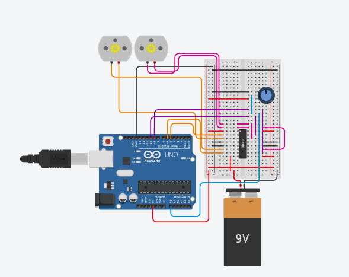

<h1>Aula 7 - Atuadores.</h1>

<a href="https://github.com/RAS-UFPB/Resumo-das-aulas-do-Grupo-de-Robotica/blob/main/Resumo%20aula%204"><h2>Resumo da aula</h2></a>

<h2>Resolução dos desafios</h2>

<h3>Desafio 1 - Faça 2 motores girarem em sentidos opostos, use um potenciômetro para decidir em qual estado os motores estarão.
</h3>

<div align='center'>
    <h4>Tabela de materiais necessários para esse desafio</h4>
    <table>
        <tr><td>Quantidade</td> <td>Item</td></tr>
        <tr><td>01</td> <td>Arduino Uno</td></tr>
        <tr><td>01</td> <td>Protoboard</td></tr>
        <tr><td>01</td> <td>Potenciômetro</td></tr>
        <tr><td>02</td> <td>Motores DC</td></tr>
        <tr><td>01</td> <td>L293D</td></tr>
        <tr><td>--</td> <td>Fios</td></tr>
    </table>
</div>

<br>
<div align="center">
    <p><b>Esquema de montagem do circuito</b></p>
</div>

<h4>Código</h4>

```c++

#define MOTOR11 5
#define MOTOR12 6
#define MOTOR21 9
#define MOTOR22 10


#define CHANGE_VALUE 510


int potValue = 0;


void setup() {
  pinMode(MOTOR11, OUTPUT);
  pinMode(MOTOR12, OUTPUT);
  pinMode(MOTOR21, OUTPUT);
  pinMode(MOTOR22, OUTPUT);
  
  
  digitalWrite(MOTOR11, LOW);
  digitalWrite(MOTOR12, LOW);
  digitalWrite(MOTOR21, LOW);
  digitalWrite(MOTOR22, LOW);
  
}

void loop() {
  potValue = analogRead(A0);
  
  if(potValue >= CHANGE_VALUE){
    digitalWrite(MOTOR11, HIGH);
    digitalWrite(MOTOR12, LOW);
    digitalWrite(MOTOR21, LOW);
    digitalWrite(MOTOR22, HIGH);
  }else{
  	digitalWrite(MOTOR11, LOW);
    digitalWrite(MOTOR12, HIGH);
    digitalWrite(MOTOR21, HIGH);
    digitalWrite(MOTOR22, LOW);
  }
  
}


```
